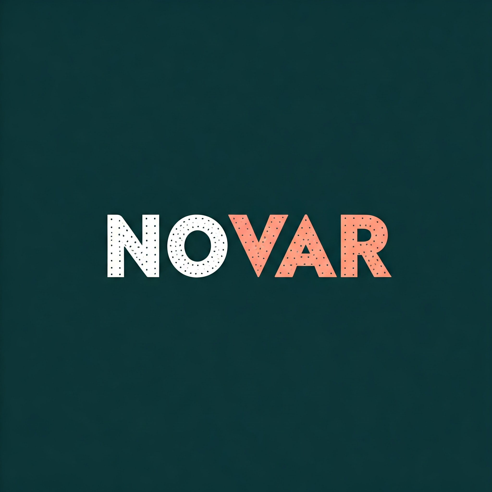

# NoVar - Visual Studio Extension

NoVar is a Visual Studio extension designed to improve code readability by replacing `var` declarations with explicit types. This extension provides two main features that allow users to replace `var` based on their specific needs.

## Features

1. **Replace All Vars**:
   - This feature replaces all instances of `var` in the current document with their corresponding explicit types.
   - Ideal for developers who prefer explicit type declarations throughout their codebase.

2. **Replace Vars Not Initialized with New**:
   - This feature replaces `var` declarations that are not initialized with the `new` keyword.
   - Useful for scenarios where you want to maintain `var` for object creation but prefer explicit types for other initializations.

## How to Use

1. **Install the Extension**:
   - Download and install the NoVar extension from the Visual Studio Marketplace.

2. **Access the Features**:
   - Open a C# file in Visual Studio.
   - Navigate to the `Edit` menu.
   - Select either `Replace All Vars` or `Replace Vars Not Initialized with New` based on your requirement.

## Installation

1. **From Visual Studio Marketplace**:
   - Go to the [Visual Studio Marketplace](https://marketplace.visualstudio.com/).
   - Search for "NoVar".
   - Click "Download" and follow the instructions to install the extension.

2. **From GitHub**:
   - Clone the repository: `git clone https://github.com/yourusername/NoVar.git`
   - Open the solution in Visual Studio.
   - Build the solution and install the extension.

## Workflow

### Replace All Vars

### Replace Vars Not Initialized with New

## Contributing

Contributions are welcome! If you have any suggestions or improvements, please create an issue or submit a pull request.

## License

This project is licensed under the MIT License - see the [LICENSE](./license.txt) file for details.

## Note

- This extension only works for `.cs` files.
